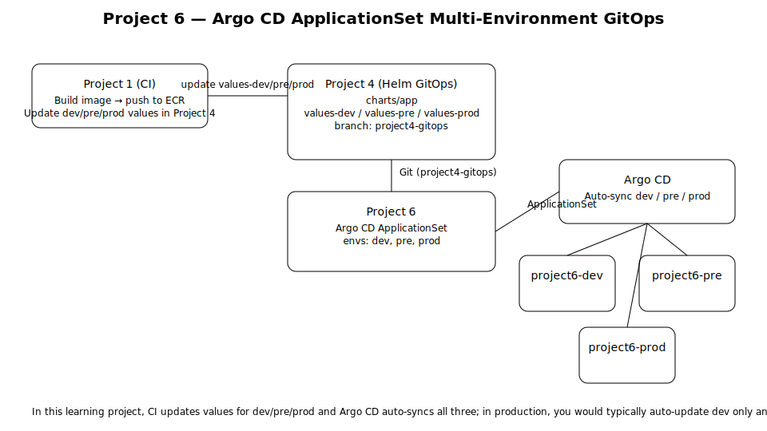

# Project 6 Architecture

This document provides a full architectural deep dive of the multi‑environment GitOps model used in Project 6.

## 1. High‑Level Overview

Project 6 relies on the following repositories:

- **Project 1:** CI pipeline – builds images, updates dev/pre/prod values in Project 4  
- **Project 4:** Helm chart repo – contains all `values-*.yaml` files  
- **Project 6:** Argo CD ApplicationSet repo – defines multi-environment fan‑out  
- **ECR:** Stores application images built by Project 1  
- **Argo CD:** Reconciles state from Git and deploys into Kubernetes namespaces  

The architecture separates responsibilities cleanly:
- Build (Project 1)
- Configuration + environment differences (Project 4)
- CD orchestration (Project 6)

## 2. Diagram

## 3. Reconciliation Flow

1. Developer commits code  
2. Project 1 builds a new container image  
3. Project 1 updates `values-dev.yaml` in Project 4  
4. Argo CD detects the change on the `project4-gitops` branch  
5. The ApplicationSet in Project 6 generates:
   - `project6-dev`
   - `project6-pre`
   - `project6-prod`
6. Each Argo CD Application deploys the Helm chart using the appropriate values file.

## 4. Namespaces and Environments

All three environments (**dev**, **pre**, **prod**) are configured with **auto-sync** in Argo CD.
Promotion to pre and prod happens by updating their values files in Project 4 (`values-pre.yaml`, `values-prod.yaml`), not by changing sync modes.

| Environment | Namespace        | Values File           | Sync Mode |
|-------------|------------------|------------------------|-----------|
| dev         | project6-dev     | values-dev.yaml        | Automated |
| pre         | project6-pre     | values-pre.yaml        | Automated |
| prod        | project6-prod    | values-prod.yaml       | Automated |

Future projects may convert pre/prod into manual sync flows to support promotion.

